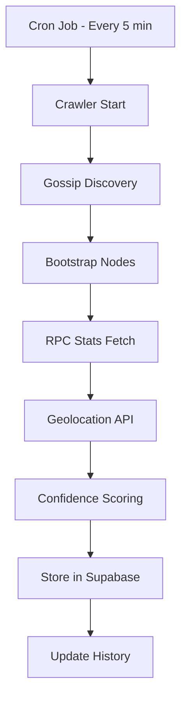

# 🏗️ Architecture & System Design

## Overview

The Xandeum pNode Analytics Dashboard is built as a **modern, scalable web application** using Next.js 15 with the App Router, React 19, and Supabase as the backend. The architecture prioritizes **performance, maintainability, and user experience**.

---

## System Architecture

```
┌─────────────────────────────────────────────────────────────┐
│                        Frontend (Next.js 15)                 │
│  ┌──────────────┐  ┌──────────────┐  ┌──────────────┐     │
│  │   React 19   │  │  TypeScript  │  │  Tailwind    │     │
│  │  Components  │  │   Type-Safe  │  │     CSS      │     │
│  └──────────────┘  └──────────────┘  └──────────────┘     │
│                                                              │
│  ┌──────────────────────────────────────────────────┐      │
│  │           App Router (Server Components)         │      │
│  │   - app/page.tsx (Dashboard)                     │      │
│  │   - app/pnode/[ip]/page.tsx (Node Details)      │      │
│  │   - app/api/* (API Routes)                       │      │
│  └──────────────────────────────────────────────────┘      │
└─────────────────────────────────────────────────────────────┘
                            ↓ ↑
┌─────────────────────────────────────────────────────────────┐
│                     API Layer (16 Endpoints)                 │
│  ┌──────────┐  ┌──────────┐  ┌──────────┐  ┌──────────┐   │
│  │ Network  │  │  Nodes   │  │   Geo    │  │   Chat   │   │
│  │  Stats   │  │  CRUD    │  │ Location │  │    AI    │   │
│  └──────────┘  └──────────┘  └──────────┘  └──────────┘   │
└─────────────────────────────────────────────────────────────┘
                            ↓ ↑
┌─────────────────────────────────────────────────────────────┐
│                  Database (Supabase / PostgreSQL)            │
│  ┌──────────────┐  ┌──────────────┐  ┌──────────────┐     │
│  │   pnodes     │  │  pnode_     │  │   network_   │     │
│  │   (main)     │  │  history    │  │   metadata   │     │
│  └──────────────┘  └──────────────┘  └──────────────┘     │
└─────────────────────────────────────────────────────────────┘
                            ↓ ↑
┌─────────────────────────────────────────────────────────────┐
│                  Data Collection (Crawler)                   │
│  ┌──────────────────────────────────────────────────┐       │
│  │  scripts/crawler.ts (Every 5 minutes via cron)   │       │
│  │  - Gossip discovery                               │       │
│  │  - RPC stats fetching                             │       │
│  │  - Geolocation                                    │       │
│  │  - Confidence scoring                             │       │
│  └──────────────────────────────────────────────────┘       │
└─────────────────────────────────────────────────────────────┘
                            ↓ ↑
┌─────────────────────────────────────────────────────────────┐
│                    External Services                         │
│  ┌──────────┐  ┌──────────┐  ┌──────────┐  ┌──────────┐   │
│  │  Xandeum │  │  ipwho   │  │ ip-api   │  │   Groq   │   │
│  │   RPC    │  │  .is     │  │  .com    │  │   AI     │   │
│  └──────────┘  └──────────┘  └──────────┘  └──────────┘   │
└─────────────────────────────────────────────────────────────┘
```

---

## Data Flow

### 1. Data Collection (Crawler)



**Crawler Phases:**
1. **Discovery** - Find nodes via gossip protocol
2. **Stats** - Fetch metrics from each node
3. **Enrich** - Add geolocation data
4. **Score** - Calculate confidence & health
5. **Store** - Persist to database
6. **History** - Archive for trends

### 2. User Request Flow

```
User → Next.js Page → API Route → Supabase → Response
                        ↓
                   Cache Layer
                   (SWR/React Query)
```

**Optimization:**
- Client-side caching (5 min)
- Server-side caching (1 min)
- Static generation where possible

---

## Component Architecture

### Frontend Structure

```
components/
├── Dashboard/          # Main dashboard components
│   ├── DashboardContent.tsx     # Main content wrapper
│   ├── Toolbar.tsx              # Top actions bar
│   ├── KpiCards.tsx             # Summary KPIs
│   ├── FilterBar.tsx            # Search & filters
│   ├── ChartsSection.tsx        # Charts display
│   ├── *Modal.tsx               # 11 analytics modals
│   └── ...
├── Chat/               # AI chatbot components
├── STOINCCalculator/   # Rewards calculator
├── common/             # Reusable UI components
├── Map3D/              # 3D visualizations (WIP)
├── EnhancedHero.tsx    # Hero section
├── NodesMap.tsx        # 2D Leaflet map
└── PNodeTable.tsx      # Main data table
```

### State Management

**No Redux needed!** Modern React patterns:

1. **Server State** - SWR for API data
2. **UI State** - useState/useReducer
3. **Global State** - Context API
   - Theme (dark/light)
   - User preferences
   - Onboarding state
4. **URL State** - Next.js router for filters

---

## Database Schema

### Main Tables

#### `pnodes`
**Primary table** storing all node data:

```sql
CREATE TABLE pnodes (
  ip TEXT PRIMARY KEY,
  pubkey TEXT,
  version TEXT,
  network TEXT,           -- 'MAINNET' | 'DEVNET'
  status TEXT,            -- 'active' | 'gossip_only'
  
  -- Geolocation
  city TEXT,
  country TEXT,
  latitude NUMERIC,
  longitude NUMERIC,
  
  -- Stats (JSONB)
  stats JSONB,           -- All RPC stats
  
  -- Scoring
  confidence_score NUMERIC,
  health_score NUMERIC,
  performance_score NUMERIC,
  
  -- Metadata
  last_seen TIMESTAMP,
  created_at TIMESTAMP DEFAULT NOW(),
  updated_at TIMESTAMP DEFAULT NOW()
);
```

#### `pnode_history`
**Time-series data** for 7-day trends:

```sql
CREATE TABLE pnode_history (
  id SERIAL PRIMARY KEY,
  ip TEXT REFERENCES pnodes(ip),
  snapshot_time TIMESTAMP,
  
  -- Snapshot of metrics
  health_score NUMERIC,
  storage_committed BIGINT,
  storage_used BIGINT,
  cpu_percent NUMERIC,
  ram_used BIGINT,
  uptime BIGINT,
  
  UNIQUE(ip, snapshot_time)
);
```

#### `network_metadata`
**Network-level aggregates**:

```sql
CREATE TABLE network_metadata (
  id SERIAL PRIMARY KEY,
  network TEXT,           -- 'MAINNET' | 'DEVNET'
  total_nodes INTEGER,
  active_nodes INTEGER,
  total_storage BIGINT,
  avg_health NUMERIC,
  timestamp TIMESTAMP DEFAULT NOW()
);
```

### Indexes

```sql
-- Performance indexes
CREATE INDEX idx_pnodes_network ON pnodes(network);
CREATE INDEX idx_pnodes_status ON pnodes(status);
CREATE INDEX idx_pnodes_health ON pnodes(health_score DESC);
CREATE INDEX idx_pnode_history_ip_time ON pnode_history(ip, snapshot_time DESC);
```

---

## Scoring Algorithms

### 1. Confidence Score (0-100)

**Purpose:** How confident are we this node is legitimate?

```typescript
confidence = 
  + uptime_score (35 points max)
  + version_score (25 points)
  + pubkey_validated (20 points)
  + official_registry (30 points)
  + storage_contribution (10 points)
```

**Thresholds:**
- 90-100: **Confirmed** (Official node)
- 70-89: **Validated** (Strong evidence)
- 50-69: **Discovered** (Some validation)
- 0-49: **Unverified** (Needs review)

### 2. Health Score (Status)

**Purpose:** Is this node healthy right now?

```typescript
if (cpu > 95%) return "Critical"
if (cpu > 90%) return "Warning"
if (uptime < 5min) return "Critical"
if (uptime < 24h) return "Warning"
if (ram > 95%) return "Critical"
if (ram > 85%) return "Warning"
if (storage > 95%) return "Critical"
if (storage > 85%) return "Warning"

// All checks passed
if (uptime > 7days && cpu < 50%) return "Excellent"
return "Good"
```

**Categories:**
- ⚡ **Excellent** - Optimal conditions
- ✅ **Good** - Normal operations
- ⚠️ **Warning** - Attention needed
- 🔴 **Critical** - Immediate action required
- 🔒 **Private** - Gossip-only node

### 3. Performance Score (0-100)

**Purpose:** How well is this node performing vs network?

```typescript
performance = 
  + version_tier (40 points)      // Consensus version?
  + storage_tier (30 points)      // Committed storage
  + uptime_factor (20 points)     // Days online
  - cpu_penalty (if > 90%)        // Resource issues
  - trynet_penalty (if dev build) // Unstable version
```

**Bonuses:**
- **Storage whale** (+5) - 10x average storage
- **Long uptime** (+10) - 30+ days

**Penalties:**
- **High CPU** (-15) - Overloaded
- **Trynet build** (-20) - Dev version
- **Gossip-only cap** (max 75) - Not fully participating

---

## API Design

### RESTful Endpoints

All API routes follow REST conventions:

```
GET    /api/pnodes           - List all nodes
GET    /api/pnodes/[ip]      - Get specific node
GET    /api/pnodes/[ip]/history - Node history
GET    /api/network-stats    - Network aggregates
POST   /api/chat             - AI chat
POST   /api/cron/crawl       - Trigger crawler
```

### Response Format

**Success:**
```json
{
  "success": true,
  "data": { ... },
  "timestamp": "2025-01-20T12:00:00Z"
}
```

**Error:**
```json
{
  "success": false,
  "error": "Error message",
  "code": "ERROR_CODE"
}
```

### Rate Limiting

```typescript
// lib/rate-limiter.ts
- 100 requests / minute / IP
- 1000 requests / hour / IP
- Exponential backoff on 429
```

---

## Caching Strategy

### Client-Side (SWR)

```typescript
useSWR('/api/pnodes', fetcher, {
  refreshInterval: 60000,      // 1 minute
  revalidateOnFocus: false,    // Don't refetch on tab focus
  dedupingInterval: 5000,      // Dedupe requests within 5s
})
```

### Server-Side (Next.js)

```typescript
export const revalidate = 60 // Revalidate every 60s
```

### Database Query Caching

```sql
-- Materialized views for expensive queries
CREATE MATERIALIZED VIEW network_summary AS
SELECT 
  network,
  COUNT(*) as total_nodes,
  SUM(CASE WHEN status = 'active' THEN 1 ELSE 0 END) as active_nodes,
  SUM(stats->>'storage_committed')::BIGINT as total_storage
FROM pnodes
GROUP BY network;

-- Refresh every 5 minutes
REFRESH MATERIALIZED VIEW CONCURRENTLY network_summary;
```

---

## Security

### Environment Variables

```bash
# Secrets (never committed)
SUPABASE_SERVICE_ROLE_KEY=xxx
GROQ_API_KEY=xxx
CRON_SECRET=xxx

# Public (can be exposed)
NEXT_PUBLIC_SUPABASE_URL=xxx
NEXT_PUBLIC_SUPABASE_ANON_KEY=xxx
```

### API Protection

```typescript
// Verify CRON_SECRET for protected endpoints
if (req.headers.authorization !== `Bearer ${process.env.CRON_SECRET}`) {
  return res.status(401).json({ error: 'Unauthorized' })
}
```

### Input Validation

```typescript
// Validate all user inputs
import { z } from 'zod'

const NodeSchema = z.object({
  ip: z.string().ip(),
  network: z.enum(['MAINNET', 'DEVNET']),
  stats: z.object({...})
})
```

---

## Deployment

### Vercel (Production)

```yaml
# vercel.json
{
  "crons": [
    {
      "path": "/api/cron/crawl",
      "schedule": "*/5 * * * *"  # Every 5 minutes
    },
    {
      "path": "/api/cron/cleanup",
      "schedule": "0 0 * * *"    # Daily at midnight
    }
  ]
}
```

### Environment Setup

1. Connect to Vercel
2. Set environment variables
3. Deploy from `main` branch
4. Cron jobs auto-configured

---

## Performance Optimizations

### Bundle Size

```bash
# Code splitting
- Dynamic imports for heavy components
- Tree-shaking unused code
- Image optimization (Next.js Image)

# Result:
- Initial JS: ~200KB (gzipped)
- Total size: ~1.2MB (first load)
```

### Rendering Strategy

```typescript
// Mix of strategies:
1. Server Components (default) - Faster initial load
2. Client Components (interactive) - Rich interactions
3. Static Generation (SEO pages) - Marketing pages
```

### Database Performance

```sql
-- Partition large tables
CREATE TABLE pnode_history_2025_01 
PARTITION OF pnode_history
FOR VALUES FROM ('2025-01-01') TO ('2025-02-01');

-- Auto-vacuum configuration
ALTER TABLE pnodes SET (autovacuum_vacuum_scale_factor = 0.1);
```

---

## Monitoring & Observability

### Logging

```typescript
// Structured logging
console.log({
  timestamp: new Date().toISOString(),
  level: 'info',
  message: 'Crawler completed',
  nodesDiscovered: 123,
  duration: '45s'
})
```

### Metrics (Planned)

- API response times
- Crawler success rate
- Database query performance
- Error rates by endpoint

---

## Testing Strategy

### Unit Tests (80 tests)

```bash
tests/
├── health.test.ts         # Health calculation logic
├── scoring.test.ts        # Scoring algorithms
├── kpi.test.ts            # KPI computations
├── utils.test.ts          # Utility functions
└── simple-integration.test.ts # Integration tests
```

### Test Coverage

- **Health logic:** 100%
- **Scoring logic:** 100%
- **KPI calculations:** 100%
- **Utilities:** 95%

### Running Tests

```bash
npm run test              # Run all tests
npm run test:watch        # Watch mode
npm run test:coverage     # Coverage report
```

---

## Scalability Considerations

### Current Scale
- 300+ nodes monitored
- ~1,000 API requests/hour
- ~10GB database size

### Future Scale (1000+ nodes)
- Horizontal scaling (Vercel auto-scales)
- Database read replicas
- CDN for static assets
- Redis caching layer

---

## Related Documentation

- [API Reference](API.md)
- [Database Schema](DATABASE.md)
- [Deployment Guide](DEPLOYMENT.md)
